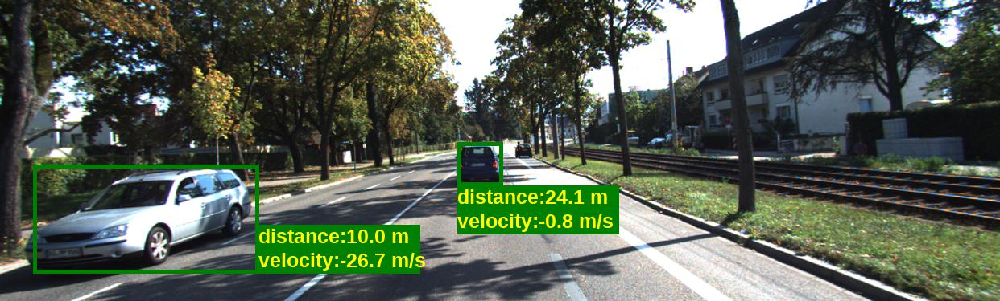

# Monocular Velocity

Model has been trained and tested on Ubuntu16.04, PyTorch 0.4.

If you use this work, please cite our paper [arxiv](https://arxiv.org/abs/2006.04082):

```angular2
@inproceedings{song2020endtoend,
    title={End-to-end Learning for Inter-Vehicle Distance and Relative Velocity Estimation in ADAS with a Monocular Camera},
    author={Zhenbo Song and Jianfeng Lu and Tong Zhang and Hongdong Li},
    year={2020},
    booktitle={International Conference on Robotics and Automation (ICRA)},
}
```

## Dataset
A pair of images is picked up along with their corresponding ground truth annotation.
All relative directories of data-pairs are saved in the text file line by line. 

### Tumsimple dataset
Specific cars are annoted by bounding boxes in the last frame of each sequence for both training and testing dataset.
Relative position and velocity are given for training in json file format. 
The dataset is available on [tusimple-benchmark](https://github.com/TuSimple/tusimple-benchmark). 

### KITTI Dataset
KITTI velocity dataset is generated from [KITTI raw dataset](http://www.cvlibs.net/datasets/kitti/raw_data.php). 
The tracking information for each car is obtained from the tracklet files. 
Time interval of one training and testing pair is 0.1s. 
Use the code 'prepare_kitti/prepare_data.py' to pre-process on KITTI raw.

## Quick Start
###  cropdata.py
To train in multi-batches, the number of cars are unified to 4 for every sequence.
The supplementary input information is pre-calculated in this dataloader:   

```
self.args.cam_fx / (t_bbox[2] - t_bbox[0]),
self.args.cam_fy / (t_bbox[3] - t_bbox[1],
self.args.cam_fy / (t_bbox[3] - t_bbox[1]),
(t_bbox[0] - self.args.cam_cx) / self.args.cam_fx,
(t_bbox[1] - self.args.cam_cy) / self.args.cam_fy,
(t_bbox[2] - self.args.cam_cx) / self.args.cam_fx,
(t_bbox[3] - self.args.cam_cy) / self.args.cam_fy
```

###  train_crop_velocity.py
Modify the arguments, then train
```
python train_crop_velocity.py
```

###  test_crop_velocity.py
The testing results are saved to a json file for evaluation.
```
python test_crop_velocity.py
```

###  evaluate.py
Modify the prediction file directory and its corresponding groud truth directory, then evalute
```
python evaluate.py
```

## References
[PWC-Net](https://github.com/NVlabs/PWC-Net)

[ROI-Align](https://github.com/longcw/RoIAlign.pytorch) 


